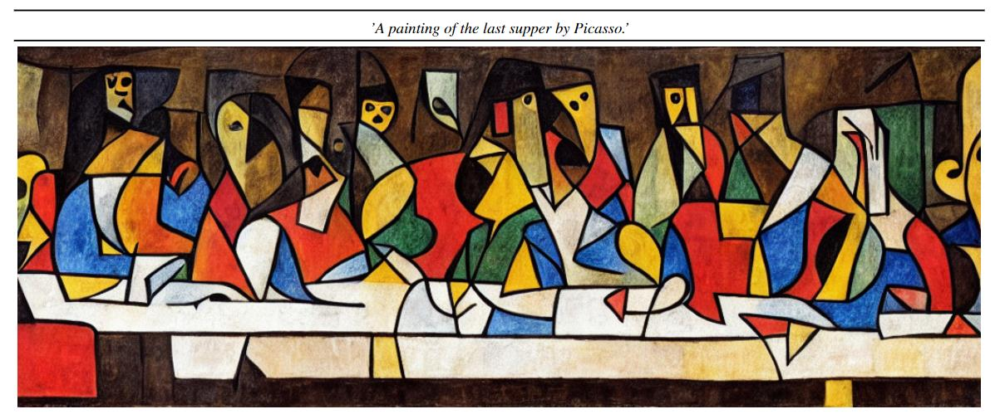

What's up, Guys!

I'm a first year PhD student from Thrust of Artificial Intelligence, [HKUST(GZ)](https://www.hkust-gz.edu.cn/). My research interest includes Trustworthy LLMs, Large Language Models, Graph Neural Networks, and Reinforcement Learning.

I am very fortunate to be advised by [Prof. Enyan](https://enyandai.github.io/) of Trust AI Lab from Thrust of Artificial Intelligence, HKUST(GZ). I was advised by Prof. Zheng from School of Software Engineering, Fudan University.
